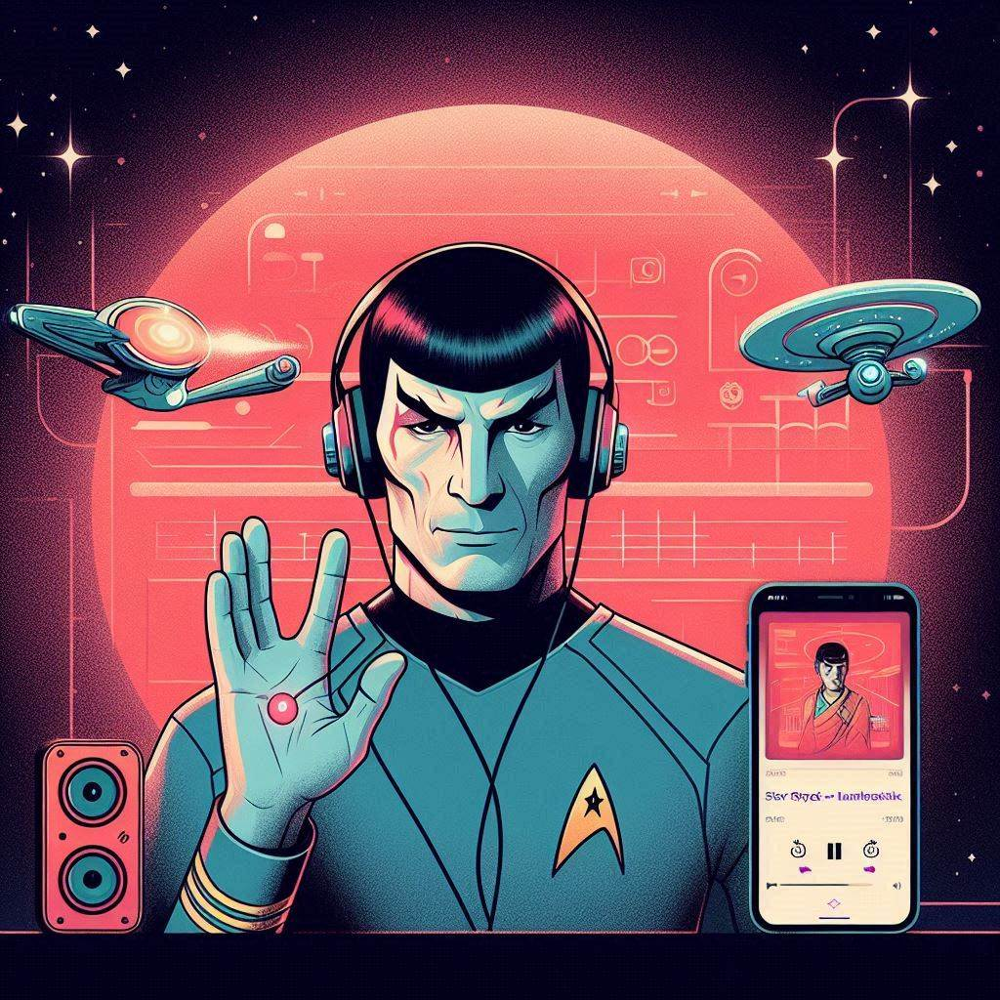

<audio autoplay="autoplay" controls="controls">
<source src="https://github.com/pizza2u/AI-Fundamentals-for-Devs/blob/podcast/output/202404251750.mp4" type="audio/mp4" />
seu navegador não suporta HTML5
</audio>

    preview do podcast

    <audio src="output/podcast_editado.MP3" controls title="Podcast editado"></audio>

# Projeto Podcast Gerado por I.A.s

Projeto com o objetivo de gerar um podcast utilizando ferramentas de IA através de prompts mais trabalhado.

## 💻 Tecnologias utilizadas no projeto

- [ChatGPT](https://chat.openai.com/) 
- [Bing](https://www.bing.com/images/create)
- [ElevenLabs](https://beta.elevenlabs.io/)
- [Capcut](https://www.capcut.com/pt-br/)

## ✨ Como foi feito ?

- Roteiro gerado via chatgpt
- Audio gerado pela elevenLabs
- Bing Para gerar imagem
- Capcut para tratar aúdio e adicionar sons de fundo

