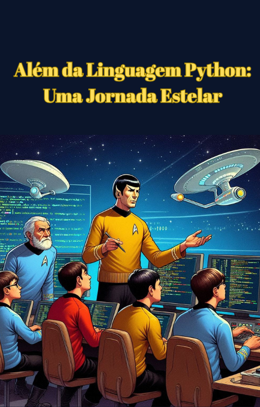

    

-------

# Projeto EBOOK Gerado por I.A.s

Projeto com o objetivo de gerar um ebook digital com as facilidades das ferramentas de IA. todos os prompts
seguem abaixo.

<a href="https://github.com/pizza2u/AI-Fundamentals-for-Devs/blob/ebook/ebook-demo.pdf" title="View PDF now"> 📕Clique aqui para ler</a>

## 💻 Tecnologias utilizadas no projeto

- [ChatGPT](https://chat.openai.com/) 
- [Bing](https://www.bing.com/images/create)
- [Canva](https://www.canva.com/)
